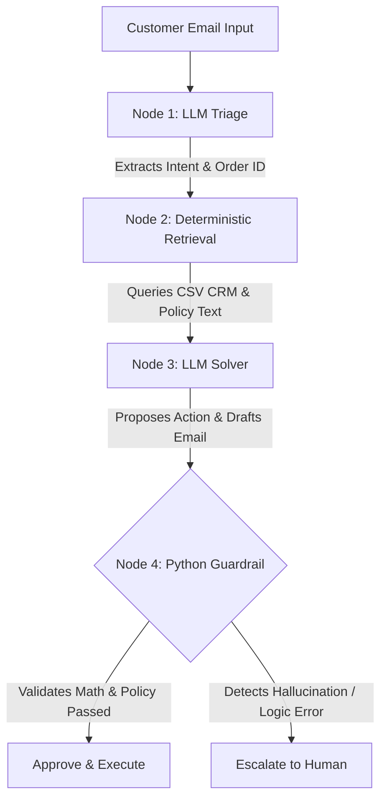

# Zero-Hallucination Customer Action Pipeline

An enterprise-grade agentic workflow that processes customer support requests, performs deterministic policy retrieval, and uses Large Language Models (LLMs) strictly for reasoning. This architecture prevents AI hallucinations through mathematical, deterministic Python guardrails.

## The Problem with Pure Agents

The industry standard of using fully autonomous agents (via ReAct loops) for enterprise tasks is flawed. Autonomous agents are prone to infinite loops, high latency, and unpredictable business actions, such as hallucinating unauthorized refunds.

## The Pipeline Solution

This project implements a State-Machine Pipeline rather than a pure agent. In this architecture, traditional code controls the flow, and the LLM is constrained to specific nodes. This guarantees predictability, enforces type safety, and ensures that no financial action is executed without passing strict mathematical validation.

## Architecture Flow



## Key Features

* Strict Type Safety: Utilizes Pydantic v2 schemas to force the LLM into generating strict JSON outputs, eliminating parsing errors common in agentic systems.
* Deterministic Guardrails: Hardcoded Python logic validates LLM outputs before any external API or database is touched. If the LLM proposes a refund exceeding the user's original purchase price, the guardrail intercepts and blocks the action.
* Zero-AI Retrieval: Database lookups and policy retrieval are handled via standard Python code, ensuring maximum reliability and zero context-window pollution.
* Lightweight Stack: Built without heavy agentic frameworks. Uses native Python, Pydantic, the Groq API (Llama-3), and Streamlit for the frontend.

## Project Structure

```text
zero-hallucination-pipeline/
├── config/
│   └── settings.py               # Type-safe environment configuration
├── data/
│   ├── customer_support_tickets.csv  # Real-world dataset mapping
│   └── refund_policy.txt         # Enterprise SLA rules
├── src/
│   ├── schemas/
│   │   └── state.py              # Pydantic models for pipeline state
│   ├── utils/
│   │   └── data_loader.py        # CSV ingestion utility
│   ├── llm/
│   │   └── provider.py           # Structured output generator via Groq
│   ├── nodes/
│   │   ├── triage.py             # Intent classification node
│   │   ├── retrieval.py          # Deterministic data fetching node
│   │   ├── solver.py             # LLM reasoning engine
│   │   └── guardrail.py          # Mathematical validation node
│   └── pipeline.py               # State machine orchestrator
├── tests/
│   └── test_pipeline.py          # Unit tests isolating guardrail logic
├── app.py                        # Streamlit web interface
├── main.py                       # CLI execution script
├── requirements.txt
└── .env.example
```

## Setup & Installation

1. Clone the repository
```bash
git clone [https://github.com/YOUR_USERNAME/deterministic-ai-workflow.git](https://github.com/YOUR_USERNAME/deterministic-ai-workflow.git)
cd zero-hallucination-pipeline
```

2. Initialize the virtual environment (Windows)
```bash
python -m venv venv
.\venv\Scripts\activate 
```

3. Install dependencies
```bash
pip install -r requirements.txt
```

4. Configure Environment Variables
Copy the `.env.example` file to a new file named `.env` and add your API key.
```text
GROQ_API_KEY=your_groq_api_key_here
LLM_PROVIDER=groq
LLM_MODEL=llama-3.3-70b-versatile
```

## Usage

### Running the Graphical Interface (Recommended)
This project includes a Streamlit frontend to visually demonstrate the pipeline's execution state and guardrail interventions.

```bash
streamlit run app.py
```

### Running the Command Line Interface
To run a headless execution through the terminal:

```bash
python main.py
```

## Testing

The project includes isolated unit tests using `pytest` to guarantee the Guardrail Node mathematically prevents LLM hallucinations.

To run the test suite:
```bash
pytest
```

## Dataset Acknowledgment
This project utilizes a modified version of the Customer Support Ticket Dataset from Kaggle to simulate real-world unstructured user queries and CRM database lookups.